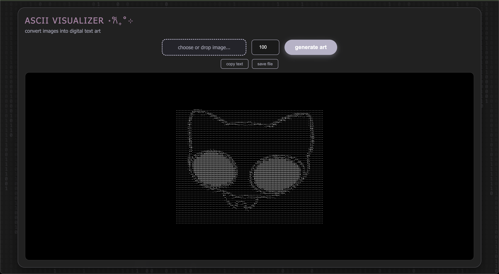

# ⋆𐙚₊˚⊹ ASCII Visualizer

a web application that converts images into ascii. featuring a cool matrix animated background, drag-and-drop functionality, and a glassmorphism UI.


## features ദ്ദി◝ ⩊ ◜.ᐟ

* **Drag & Drop Support:** drop images directly from your desktop or the internet.
* **Glassmorphism UI:** a modern, frosted-glass interface overlaying an animated binary rain background.
* **Export Options:** one-click buttons to **copy to clipboard** or **save as .txt**.

## tech stack .✦ ݁˖

* **Backend:** Python (Flask)
* **Image Processing:** Pillow (PIL)
* **Frontend:** HTML5, CSS3 (Flexbox/Grid), JavaScript
* **Utilities:** `requests` (for downloading web images)

## How to Run Locally .☘︎ ݁˖

### 1. Clone the repository 𖦹
```bash
git clone [https://github.com/nidarath/ascii-generator.git](https://github.com/nidarath/ascii-generator.git)
cd ascii-generator
```

### 2. Set up the environment 𖦹
- recommended to use a virtual environment.

#### Mac/Linux: 

  ```bash
  
  python3 -m venv venv
  source venv/bin/activate
  ```
#### Windows:
  ```Bash
  
  python -m venv venv
  .\venv\Scripts\activate
  ```

### 3. Install dependencies 𖦹
  ```Bash
  
  pip install -r requirements.txt
  ```

### 4. Run the App 𖦹
  ```Bash
  python app.py
  Open your browser and navigate to: http://127.0.0.1:5000
  ```

## customization
 - modify the ASCII characters in logic.py to change the texture of the art.
